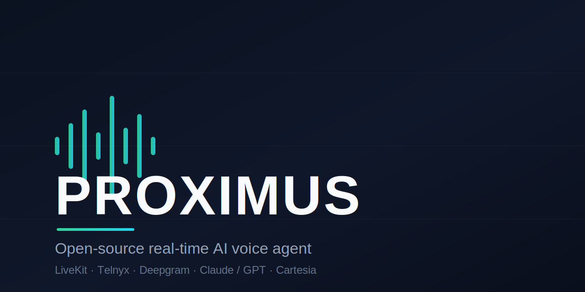
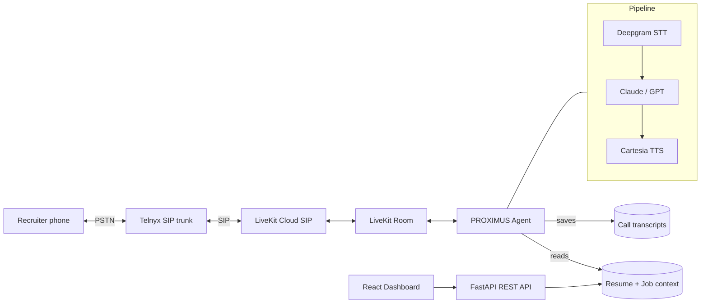

<p align="center">
  
</p>

<p align="center">
  <a href="LICENSE"></a>
  <a href="https://github.com/Adawodu/PROXIMUS/actions/workflows/ci.yml"></a>
  
</p>

# PROXIMUS

> An open-source reference implementation of a real-time AI voice agent — built
> around a practical use case: a **personal recruiter-screening assistant**.

PROXIMUS connects a phone call to a full voice pipeline (Speech-to-Text → LLM →
Text-to-Speech) over SIP telephony. The flagship example is a screening
assistant that uses **your own resume** to help handle or rehearse recruiter
screening calls — a tool you run, on your own calls. The underlying stack is
general-purpose: swap the prompt and you have a starting point for any voice
agent.

> [!IMPORTANT]
> PROXIMUS speaks on live phone calls. Please read
> [RESPONSIBLE_USE.md](RESPONSIBLE_USE.md) — consent, disclosure, and honesty
> matter, and AI-on-call rules vary by jurisdiction.

## Why PROXIMUS

- **A real, end-to-end voice agent** — not a toy. SIP trunking, barge-in,
  endpointing, transcript capture, inbound *and* outbound calls.
- **Provider-agnostic** — Claude or GPT for the LLM; pluggable STT/TTS.
- **Self-hosted** — your keys, your data, runs on your machine.
- **A clean reference** — readable Python + a React dashboard you can learn from
  or build on.

## Features

- **Voice agent** — Real-time phone conversations via Deepgram STT + LLM +
  Cartesia TTS, orchestrated by LiveKit Agents
- **Inbound & outbound** — Answer incoming screening calls, or have the agent
  dial a recruiter and introduce itself
- **Resume context** — Upload a PDF, DOCX, or TXT resume; the agent answers using
  its content (truthfully — it defers rather than fabricates)
- **Phone linking** — Map phone numbers to resumes for automatic call routing
- **Job context** — Optionally pass a job description into a call for relevant answers
- **Transcripts** — Every call's turns are captured and saved
- **Web dashboard** — React + TypeScript UI for resumes, phone links, call
  history, and outbound dialing

## Demo

See a [sample screening-call transcript](docs/demo-transcript.md) for how the agent
sounds — concise, first-person, and truthful (it defers instead of fabricating).
Your own calls are captured automatically and viewable in the dashboard's
**Call History**.

## Architecture



**Components:**

- `src/proximus/agent/` — LiveKit voice agent (STT/LLM/TTS pipeline) + outbound dialing
- `src/proximus/api/` — FastAPI REST API for resume, phone, and call management
- `src/proximus/ai/` — Provider-agnostic AI layer (Anthropic / OpenAI)
- `src/proximus/context/` — Resume parsing, phone→resume mapping, call records
- `src/proximus/sip/` — Telnyx/LiveKit SIP setup helpers
- `web/` — React + Vite dashboard

## Quick Start

### Prerequisites

- Python 3.12+
- Node.js 18+ (for the web dashboard)
- Accounts: [Telnyx](https://telnyx.com), [LiveKit Cloud](https://cloud.livekit.io),
  [Deepgram](https://deepgram.com), [Cartesia](https://cartesia.ai), and
  [Anthropic](https://anthropic.com) or [OpenAI](https://openai.com)

### Backend

```bash
python3.12 -m venv .venv
source .venv/bin/activate
pip install -e ".[dev]"

cp .env.example .env
# Edit .env with your API keys

python -m proximus api          # Start REST API (port 8000)
python -m proximus agent dev    # Start the voice agent
```

### Web Dashboard

```bash
cd web
npm install
npm run dev                     # Start dev server (port 5173)
```

### SIP Setup

```bash
python -m proximus sip setup    # Show Telnyx/LiveKit setup instructions
python -m proximus sip config   # Show current SIP configuration
```

## Documentation

- [Architecture](docs/architecture.md) — System design, call flow, components
- [Setup Guide](docs/setup.md) — Full installation and configuration walkthrough
- [API Reference](docs/api-reference.md) — All REST API endpoints
- [Development](docs/development.md) — Dev workflow, testing, contributing

## Known Limitations

PROXIMUS is pre-1.0 and self-hosted by design. It currently:

- Has **no authentication** on the API — don't expose it publicly without your
  own auth/proxy
- Stores data as **JSON files** on local disk (no database yet)
- Runs **locally** (uvicorn + LiveKit dev mode); no managed deployment
- Has **no billing / multi-tenancy**

See [docs/progress.md](docs/progress.md) for the full status and roadmap.

## Contributing

Contributions are welcome! See [CONTRIBUTING.md](CONTRIBUTING.md) to get started,
and look for [`good first issue`](https://github.com/Adawodu/PROXIMUS/labels/good%20first%20issue).
By participating you agree to the [Code of Conduct](CODE_OF_CONDUCT.md).

Good areas to contribute: additional STT/TTS/LLM providers, a Twilio telephony
backend, a database/storage layer, tests, and docs.

## Security

Found a vulnerability? Please report it privately — see [SECURITY.md](SECURITY.md).

## License

[MIT](LICENSE) © [Adebayo Dawodu](https://adawodu.com)
