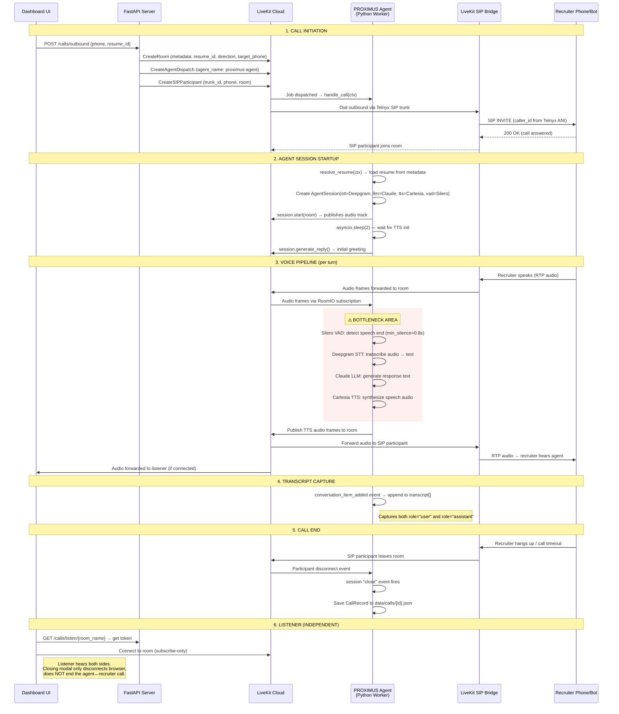

# PROXIMUS Outbound Call Flow

## Sequence Diagram

## Timing Analysis — Identified Gaps

From the outbound call transcript `8afc96f4b51d`:

| Gap | Between | Duration | Cause |
|-----|---------|----------|-------|
| **Gap 1** | Recruiter finishes greeting → Agent first reply | **23.1s** | VAD (0.8s) + STT + LLM cold start + TTS |
| **Gap 2** | Recruiter asks question → Agent reply | **26.9s** | VAD waits for long silence after multi-sentence speech |
| **Gap 3** | Recruiter asks about role → Agent reply | **63.5s** | LLM generating long response + TTS synthesis |
| **Gap 4** | Recruiter asks about Laffa.io → Agent reply | **89.6s** | LLM generating very long response |

### Root Causes

1. **VAD `min_silence_duration=0.8s` is too conservative** — The recruiter bot speaks in
   multiple short sentences with pauses between them. The VAD keeps waiting for 0.8s of
   silence, but each new sentence resets the timer. The agent can't start processing
   until VAD confirms the speaker is done.

2. **LLM response too long** — Claude is generating multi-paragraph responses. The TTS
   must synthesize all of it before (or while) playing. Long responses = long gaps.

3. **No streaming TTS** — If TTS isn't streaming chunks as they're generated, the full
   response must be synthesized before playback begins.

4. **User turns are fragmented** — The recruiter bot's speech arrives as many small
   `conversation_item_added` events (56 "user" turns for ~6 actual statements), suggesting
   STT is emitting partial/sentence-level segments rather than full turns.

### Recommended Fixes

| Fix | Change | Impact |
|-----|--------|--------|
| Reduce VAD silence | `min_silence_duration=0.5` for outbound | Agent responds faster after recruiter stops |
| Shorten LLM responses | Add instruction: "Keep responses under 3 sentences" | Reduces TTS synthesis time |
| Tune `max_endpointing_delay` | Set on AgentSession to cap wait time | Prevents 60s+ gaps |
| Reduce `min_endpointing_delay` | Lower from default to respond sooner | Faster turn-taking |
